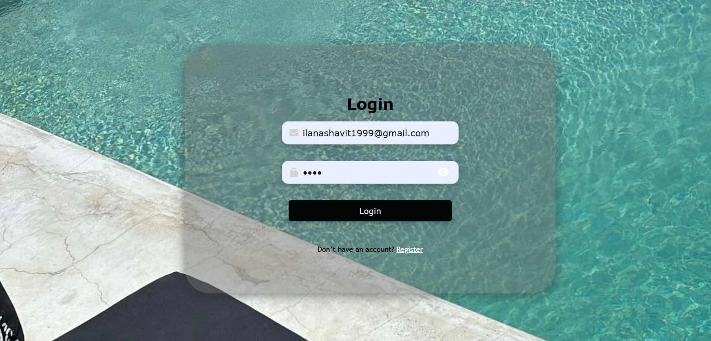
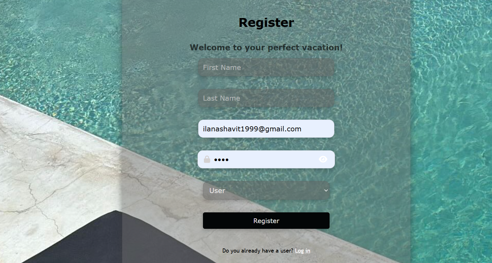
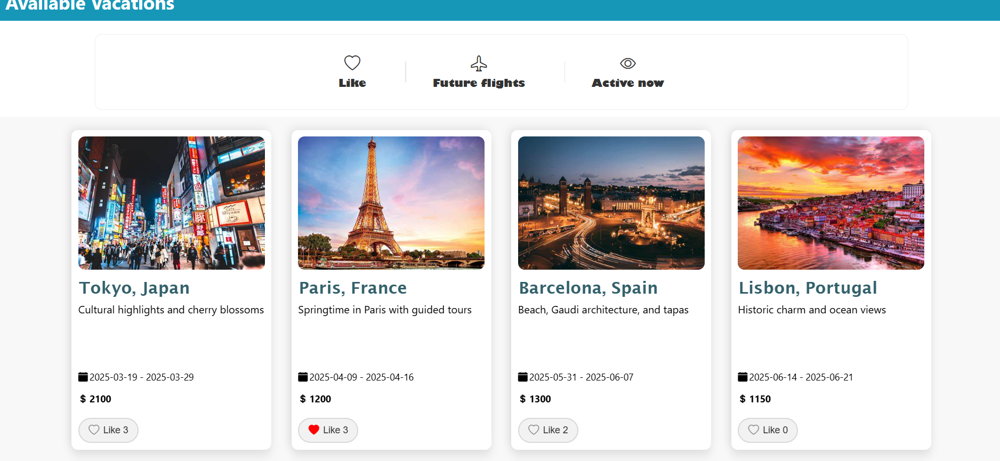
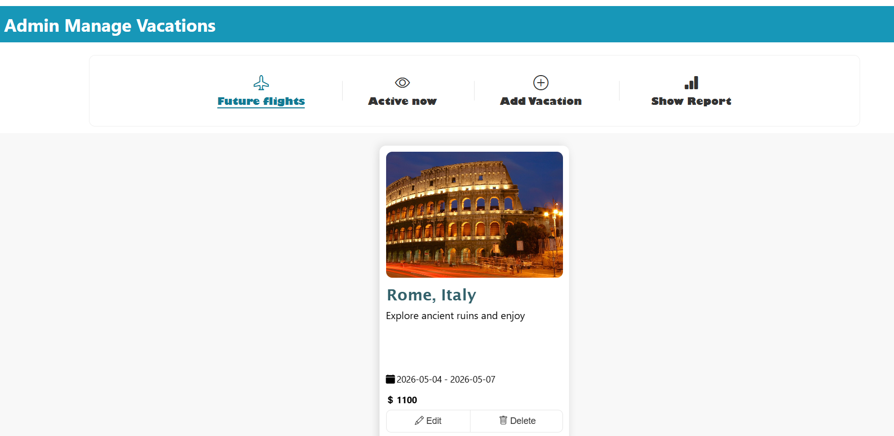
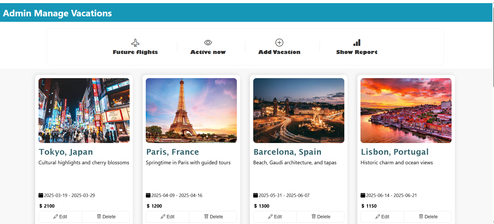
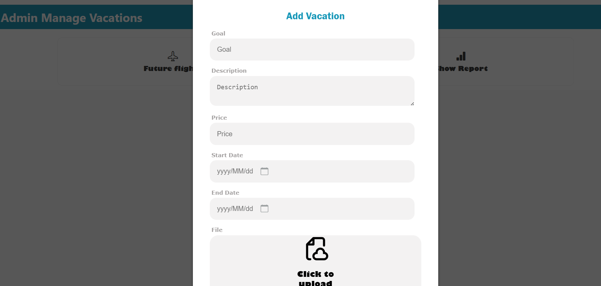
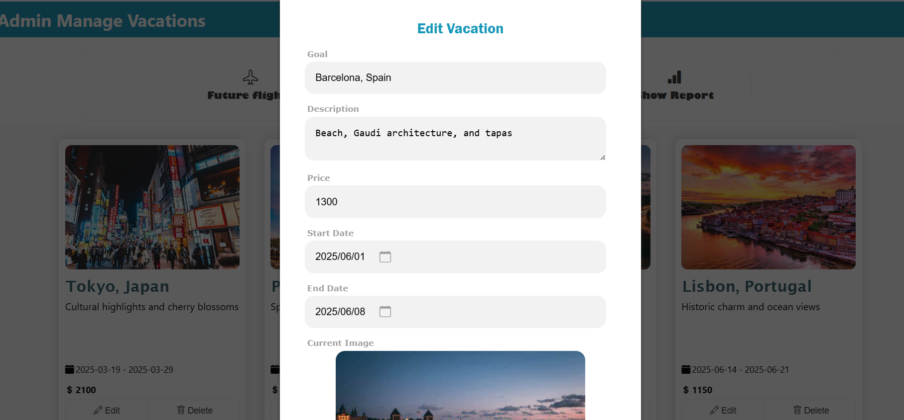
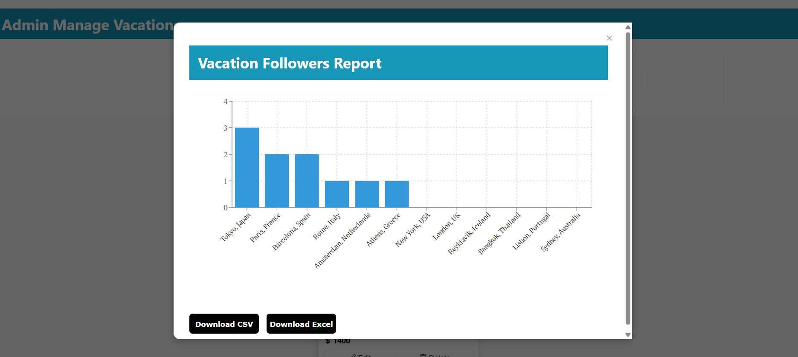

# 🌍 Vacation Management System

## 📌 תיאור הפרויקט

מערכת לניהול חופשות הכוללת ממשק משתמש וממשק אדמין, עם חיבור לשרת ולמסד נתונים MySQL.

המערכת מאפשרת למשתמשים לצפות בחופשות, לבצע לייק (Follow), ולסנן תוצאות לפי מצב (עתיד / פעיל).  
בנוסף, אדמין יכול לנהל חופשות באופן מלא – הוספה, עריכה, מחיקה וצפייה בדוחות.

---

## 🚀 פיצ'רים מרכזיים

### 👤 משתמשים
- הרשמה והתחברות עם אימות נתונים
- שמירת משתמש ב־LocalStorage
- מעבר אוטומטי לפי Role (Admin / User)

📄 מבוסס על:
:contentReference[oaicite:0]{index=0}  
:contentReference[oaicite:1]{index=1}  

---

### 🌴 צפייה בחופשות
- הצגת כרטיסיות חופשה עם תמונה, תיאור, מחיר ותאריכים
- אפשרות לעשות Like (Follow)
- ספירת עוקבים לכל חופשה
- סינון לפי:
  - חופשות עתידיות
  - חופשות פעילות
  - חופשות במעקב

📄 מבוסס על:
:contentReference[oaicite:2]{index=2}  

---

### 🛠 ממשק אדמין
- צפייה בכל החופשות
- סינון מתקדם (Active / Future)
- Pagination
- הוספה / עריכה / מחיקה של חופשות

📄 מבוסס על:
:contentReference[oaicite:3]{index=3}  

---

### ➕ הוספת חופשה
- טופס כולל:
  - יעד (Goal)
  - תיאור
  - מחיר
  - תאריכים (DatePicker)
  - העלאת תמונה
- ולידציות:
  - שדות חובה
  - מחיר בטווח
  - תאריך התחלה לא בעבר
  - תאריך סיום אחרי התחלה

📄 מבוסס על:
:contentReference[oaicite:4]{index=4}  

---

### ✏️ עריכת חופשה
- טעינת נתונים קיימים מהשרת
- אפשרות לעדכן כולל תמונה
- ולידציות

📄 מבוסס על:
:contentReference[oaicite:5]{index=5}  

---

### 📊 דוחות (Admin בלבד)
- גרף המציג כמות עוקבים לכל חופשה
- מיון לפי פופולריות
- הורדת נתונים כ:
  - CSV
  - Excel

📄 מבוסס על:
:contentReference[oaicite:6]{index=6}  

---

## 🧠 טכנולוגיות

### Frontend
- React + TypeScript
- CSS (Custom UI)
- React Router
- Axios / Fetch

### Backend
- Node.js (API)
- REST API

### Database
- MySQL

### Libraries
- Recharts (גרפים)
- XLSX (ייצוא לאקסל)
- FileSaver
- React DatePicker

---

## 🔐 הרשאות משתמשים

- **User רגיל**:
  - צפייה בחופשות
  - לייקים

- **Admin**:
  - CRUD מלא על חופשות
  - צפייה בדוחות

---
---

## 🎥 Demo Video

[Watch Demo](assets/images/DEMO.mp4)

---

## 📸 Screenshots

### 🔐 Login & Register

מסכי התחברות והרשמה עם אימות נתונים והפרדה לפי סוג משתמש.




---

### 🌴 Available Vacations (User)

תצוגת חופשות למשתמש כולל:
- תמונות
- תאריכים
- מחיר
- לייקים (Follow)
- פילטרים



---

### ❤️ future flights

טיסות עתידיות



---

### 🛠 Admin Panel

ממשק אדמין לניהול חופשות כולל:
- עריכה
- מחיקה
- פילטרים
- pagination



---

### ➕ Add Vacation

טופס הוספת חופשה עם:
- העלאת תמונה
- בחירת תאריכים
- ולידציות



---

### ✏️ Edit Vacation

עריכת חופשה קיימת כולל תצוגת תמונה קיימת והחלפה.



---

### 📊 Reports Dashboard

גרף המציג כמות עוקבים לכל חופשה + הורדה ל־CSV/Excel.



---
-----

## ⚙️ התקנה והרצה

```bash
npm install
npm start
